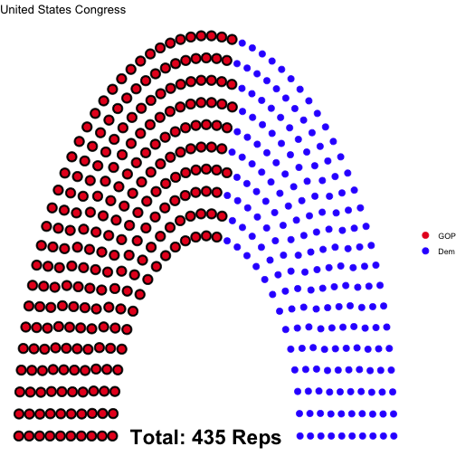
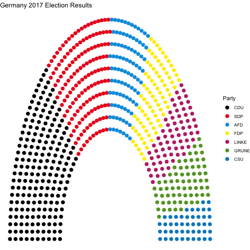
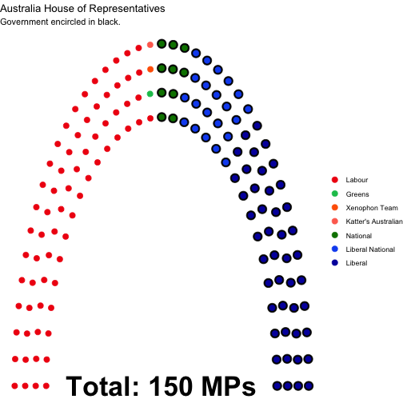

```r
knitr::opts_chunk$set(echo = TRUE, warning = FALSE)
source("R/parliament_data.R")
source("R/helper_funcs.R")
load("data/election_data.rda")
library(tidyverse)
```

```
## ── Attaching packages ────────────────────────────────── tidyverse 1.2.1 ──
```

```
## ✔ ggplot2 2.2.1.9000     ✔ purrr   0.2.5     
## ✔ tibble  1.4.2          ✔ dplyr   0.7.5     
## ✔ tidyr   0.8.1          ✔ stringr 1.3.1     
## ✔ readr   1.1.1          ✔ forcats 0.3.0
```

```
## ── Conflicts ───────────────────────────────────── tidyverse_conflicts() ──
## ✖ dplyr::filter() masks stats::filter()
## ✖ dplyr::lag()    masks stats::lag()
```

# Parliament plots

This package attempts to implement "parliament plots" - visual representations of the composition of legislatures that display seats color-coded by party. The input is a data frame containing one row per party, with columns representing party name/label and number of seats,
respectively.

Inspiration from this package comes from: [parliamentdiagram](https://github.com/slashme/parliamentdiagram), which
is used on Wikipedia, [parliament-svg](https://github.com/juliuste/parliament-svg), which is a
javascript clone, and [a discussion on StackOverflow](http://stackoverflow.com/questions/42729174/creating-a-half-donut-or-parliamentary-seating-chart), which provided some of the code for part for the "arc" representations used in this package.

Unique parliament layouts:
==========================

Monkey Cage article :
<https://www.washingtonpost.com/news/monkey-cage/wp/2017/03/04/these-5-designs-influence-every-legislature-in-the-world-and-tell-you-how-each-governs/?utm_term=.e1e1c1c3c37b>


## Semicircle parliament

### EU, France, United States, and so on...

#### Data


```r
us_congress <- election_data %>%
  filter(country == "USA" &
    year == "2016" &
    house == "Representatives")
us_congress1 <- parliament_data(election_data = us_congress,
  type = "semicircle",
  total_seats = sum(us_congress$seats),
  parl_rows = 10,
  party_names = us_congress$party_short,
  party_seats = us_congress$seats)
us_senate <- election_data %>%
  filter(country == "USA" &
    year == "2016" &
    house == "Senate")
us_senate <- parliament_data(
  election_data = us_senate,
  type = "semicircle",
  total_seats = sum(us_senate$seats),
  parl_rows = 4,
  party_names = us_senate$party_short,
  party_seats = us_senate$seats)
```

#### Plot


```r
ggplot(us_congress1, aes(x, y, colour = party_short)) +
  geom_parliament_seats() + 
  geom_highlight_government(government == 1) +
  theme_void() +
  labs(colour = "", title = "United States Congress") +
  annotate("text", x=0, y=0, label=paste("Total:", sum(us_congress$seats), "Reps"), fontface="bold", size=8) +
  scale_colour_manual(values = us_congress1$colour, limits = us_congress1$party_short)
```




```r
senate <- ggplot(us_senate, aes(x=x, y=y, colour=party_long)) +
  geom_parliament_seats() + 
  geom_highlight_government(government == 1) +
  theme_void() +
  labs(colour = "", 
       title = "United States Senate",
       subtitle = "Government encircled in black.") +
  scale_colour_manual(values = us_senate$colour, limits=us_senate$party_long)
senate 
```


```r
germany <- election_data %>%
  filter(year==2017 & country=="Germany")
#View(germany)
germany <- parliament_data(election_data=germany, 
                           total_seats = sum(germany$seats), 
                           parl_rows=10,
                           party_seats=germany$seats, 
                           type='semicircle')

ggplot(germany, aes(x,y,colour=party_short))+
  geom_parliament_seats()+
  #geom_highlight_government(government==1) + 
  labs(colour="Party", title="Germany 2017 Election Results") + 
  theme_void()+
  scale_colour_manual(values = germany$colour, limits=germany$party_short)
```




## Horseshoe parliament

### Australia, New Zealand

#### Data


```r
australia <- election_data %>%
  filter(year == 2016 &
    country == "Australia" &
    house == "Representatives")
australia <- australia[c(1, 5, 6, 7, 4, 3, 2), ]

aus <- parliament_data(election_data = australia,
  total_seats = sum(australia$seats),
  party_seats = australia$seats,
  parl_rows = 4,
  type = "horseshoe")
```

#### Plot


```r
ggplot(aus, aes(x, y, colour=party_long)) +
  geom_parliament_seats() + 
  theme_void() +
  geom_highlight_government(government == 1) + 
  labs(colour = "", title = "Australia House of Representatives",
    subtitle = "Government encircled in black.") +
  annotate("text", x=0, y=0, label=paste("Total: 150 MPs"), fontface="bold", size=12) +
  scale_colour_manual(values = aus$colour, limits = aus$party_long)
```




